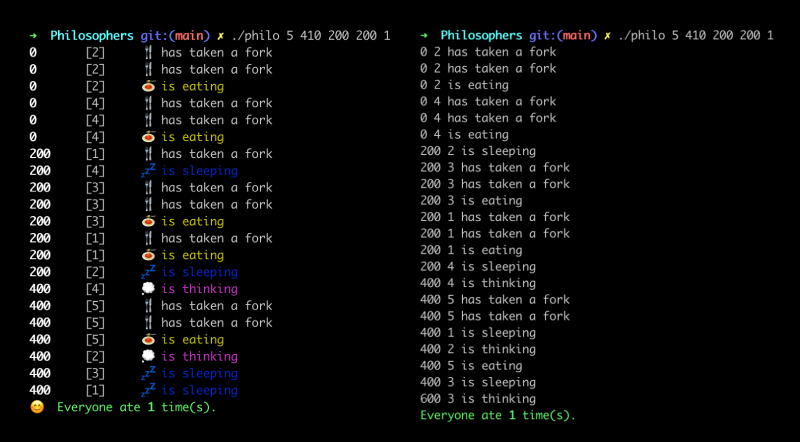

<h1 align="center">Philosophers</h1>
<p align="center">
<br />
My work on the 42Born2Code <b>Philosophers</b> project.<br /><br />
</p>

> In this project, you will learn the basics of threading a process.  
You will see how to create threads and you will discover mutexes.

# Project Requirement Checklist

<details>
<summary><i>(+ click to expand)</i></summary>

- [x] Compile project using `cc`
- [x] Global variables are forbidden
- [x] Program should take the following arguments : `number_of_philosophers die_t eat_t sleep_t
  [number_of_times_each_philosopher_must_eat]`
  - `number_of_philosophers`: The number of philosophers and also the number
    of forks.
  - `die_t` (in milliseconds): If a philosopher didn’t start eating die_t milliseconds since the beginning of their last meal or the beginning of the simulation, they die.
  - `eat_t` (in milliseconds): The time it takes for a philosopher to eat. During that time, they will need to hold two forks.
  - `sleep_t` (in milliseconds): The time a philosopher will spend sleeping.
  - `number_of_times_each_philosopher_must_eat` (_optional argument_): If all philosophers have eaten at least `number_of_times_each_philosopher_must_eat` times, the simulation stops. If not specified, the simulation stops when a philosopher dies.
- [x] Each philosopher has a number ranging from 1 to `number_of_philosophers`.
- [x] Philosopher `number 1` sits next to philosopher number `number_of_philosophers`. Any other philosopher number `N` sits between philosopher number `N - 1` and philosopher number `N + 1`.

**General rules**

- The philosophers alternatively eat, think, or sleep.
  - While they are eating, they are not thinking nor sleeping;
  - While thinking, they are not eating nor sleeping;
  - While sleeping, they are not eating nor thinking.

- There are also forks on the table. There are as many forks as philosophers.
- Because serving and eating spaghetti with only one fork is very inconvenient, a
philosopher takes their right and their left forks to eat, one in each hand.
- When a philosopher has finished eating, they put their forks back on the table and
start sleeping. Once awake, they start thinking again. The simulation stops when
a philosopher dies of starvation.
- Every philosopher needs to eat and should never starve.
- Philosophers don’t speak with each other.
- Philosophers don’t know if another philosopher is about to die.
- No need to say that philosophers should avoid dying!

**Rules for the mandatory part**

- [x] Each philosopher should be a thread.
- [x] There is one for between each pair of philosophers. Therefore, if there are several philosophers, each philosopher has a fork on their left side and a fork on their right side. If there is only one philosopher, there should be only one fork on the table.
- [x] To prevent philosophers from duplicating forks, you should protect the forks state with a mutex for each of them.

**About the logs of the program**

- [x] Any state change of a philosopher must be formatted as follows:
  - timestamp_in_ms X has taken a fork
  - timestamp_in_ms X is eating
  - timestamp_in_ms X is sleeping
  - timestamp_in_ms X is thinking
  - timestamp_in_ms X died
> Replace timestamp_in_ms with the current timestamp in milliseconds and X with the philosopher number.
- [x] A displayed state message should not be mixed up with another message.
- [x] A message announcing a philosopher died should be displayed no more than 10 ms after the actual death of the philosopher.
- [x] Again, philosophers should avoid dying!

> The program must not have any data races.

</details>

# Process for this project

> My program has a "visual mode" 🌈 that is used by default, but the basic output setting can be activated by compiling with flag `-D BORING`.

<p align="center"></p>


1. Check and parse arguments.
   - Avoid doing any `malloc()` before checking every argument.
      - This way if anything is wrong you don't have to handle leaks.
2. Assign main t_rules variables with corresponding arguments.
3. Initialize mutex.
4. Link every philo to their correct `right_fork` and `left_fork`.
5. Correctly link the t_philo & t_rules structures (every t_philo node is indexed in t_rules, and all t_philos contain a link to rules)
6. Create an `opti_sleep()` function that allows to `usleep()` only by short increments and therefore not sleep if another philo has died while one was sleeping.
   - This keeps the simulation from hanging after a philo has died in this kind of test: `5 150 100 30000`
7. Create a `print_status()` function that is protected by a mutex, so different threads that will use it will not be able to use it simultaneously, printing gibberish.
   - It will also stop printing if someone is dead.
8. Start `routine()`:
   1. Philos pick up their forks.
      - Odd philos pick up left `fork` then right `fork`.
      - Even philos do the opposite.
      - If there is only one philo in the simulation, it seems logical that they would pick up one `fork` and, not being able to pick up a second one, would die at `die_t`.
        - This is handled in the `fork_pickup()` and `routine()` functions.
   2. The once they have both their `forks`, they start `eating()`, they put down their forks, then start`sleeping` and `thinking`.
      - This is where I check for dead philos, in the `change_state()` function, which is called everytime a philo has to change its state.
        - I will print the new state (`x is eating`), but before I sleep I check if the philo has enough time left to sleep the required amount by doing a simple `if (time_since_last_meal + time_to_sleep > philo->rules->die_t)`.
          - If the philo is too close to death and would not be able to sleep the full amount, it is marked as dead in the main structure and will only sleep until `philo->rules->die_t - time_since_last_meal`.
   3. If a philo is marked as dead:
      - The `print_status()` function will stop printing anything, unless `someone_died >= 1` and the message has the word `died` in it.
      - Then all the threads will finish their current routine and won't start it again since they can tell someone died.
   4. If nobody dies, the routine stops by itself by checking if the current philo has eaten `number_of_times_each_philosopher_must_eat`.
9. In the main, all threads are `joined` so the program waits for them to finish.
10. At the very end I check if the number of philos that have eaten `number_of_times_each_philosopher_must_eat` is equal to the number of philosophers in the simulation.
    - If so, a special message is printed on screen.
11. ⚠️ How I handled if a `pthread_create` or `pthread_join` failed (nobody checked for this case during evaluation but it was fun to think of a way to handle it) : I will print an error message on screen and set `someone_died == -1`, but I will *not* stop the program.
    - This way, the error message is printed, notifying that an `init`/`create` failed, but nothing else will print, and the simulation stops quickly since `someone_died` is no longer `0`.
    - **Why do this ?**  
    Because if I return from my program as soon as one of these fail, I will have leaks since I might exit the program while some threads are still running.
    - To do this, in my `main()` (for `pthread_join`) and `launch_philos()` (for `pthread_create`), if there is a failure I only store an error code in a local variable (initialized at `0`), and let the `join`/`create` loops run their normal courses. That error code (`0` or `1`) is captured in the main and returned.

# Test cases
>(tested for leaks and data races)

### Basic tests (correction)
🟩 `1 800 200 200` should die  
🟩 `5 800 200 200` should go on forever  _(mine lasts for > 1 minute)_  
🟩 `5 800 200 200 7` simulation should stop after eating 7 times  
🟩 `4 410 200 200` should go on forever   _(mine lasts for > 1 minute)_  
🟩 `4 310 200 100` should die _(dies in ok time)_

(The higher philo numbers work better in the `BORING` mode, compiling with `-D BORING`)

### Specific cases
🟩 `5 150 100 30000` philo should die and simulation should stop before sleep time is over.

### Impairs
🟩 `199 620 200 200 50`  
🟩 `199 610 200 200 50`  
🟩 `199 600 200 200 50`

### Pairs
🟩 `200 450 200 200 50`  
🟩 `200 440 200 200 50`  
🟩 `200 420 200 200 50`  
🟩 `200 410 200 200 50`

# Error Checking

### Parsing
- [x] Number of philos is <= 0
- [x] Number of milliseconds is <=0 (= 0 aussi ?)
- [x] Arguments contain forbidden characters
- [x] Argument overflow ( > `MAX_INT`)
- [x] Argument underflow (< `MIN_INT`)

### Leaks (+ Data races ⭐)
- [x] Any of the parameters are incorrect
- [x] Malloc failed
  - [x] For the forks
  - [x] For the philo struct array
  - [x] For any of the philo structs in the array
- [x] Mutex_init failed
- [x] Thread init failed  
~~- [ ] Any mutex lock/unlock failed~~ (make the code really really long)
- [x] ⭐ Philo dies
- [x] ⭐ Odd number of philo dies
- [x] ⭐ Single philo dies

# Notes

- Philos are basically structures.
- The program needs to be compiled and linked with special flag: `-pthread` (see [man](http://manpagesfr.free.fr/man/man7/pthreads.7.html))
- Dans discord ils parlent de `fsanitize=thread`
- Toujours tester avec `valgrind --tool=helgrind` pour voir les data race
  - Mais aussi tester avec juste `valgrind` parce que avec `helgrind` les leaks n'apparaissent pas
- Ne jamais tester le fonctionnement du programme avec `valgrind` par contre, parce que ca met une plombe et que ca tue toutes les perfs. Il sert juste à checker les leaks.
- _Hint: try launching philos by even/odd number_
- Keep in mind the first and last philo that are usually trouble.
- Think about how to check if a philo has died.
- Converting time values:
  - Milliseconds = seconds * 1000
  - Milliseconds = microseconds / 1000 (or microseconds * 0.001)

# Discord tips

<details><summary>(click to see tips)</summary>

> Pour le décalage de création de thread par le main thread tu peux bloquer un mutex dans ton main thread et le débloquer quand ta boucle de création est terminée pour que tous les philos commencent en même temps leur routine. (deso si c'est plus d'actualité)

>./philosophers 200 410 200 200 devrait normalement fonctionner si votre philo est correct (ajoutez  | xclip -selection C, ça vous copiera dans le presse-papiers les prints de votre philo)
(Et oui, même sur les ordis de 42, le 400 410 200 200 passe)

> jai une variable commune a tous les threads qui est is dead, donc quand elle passe a 1, ils sortent de ma fonction routine

> Le pb d'alterner gauche et droite en premier sans usleep c'est qu'avec beaucoup de philos ya de bonne chances que le temps que les derniers philos se lancent il y ai tun decalage droitier gaucher.
> Perso je devalais de time_to_eat histoire de laisser le temps aux premiers servis de manger.

Quand on a un seul philo, il faut gerer:
> Oui bah tu lock la seule fork, tu usleep time_to_die, tu unlock la fork et tu die, dans une fonction spécifique dans ta routine
> En gros `./philo 1 300 100 100` ca donne un truc du genre:  
> 
> `0 #1 has taken a fork`  
> `300 #1 died`

Quand on rencontre une erreur:
> Dans ton thread, dès que tu détectes que tu dois exit, tu dois unlock tout ce que tu as lock. C'est le thread qui a lock le mutex qui doit le delock.

> 💅 Il n'y a pas forcement besoin de faire des micro usleep pour verifier si le philo meurt pendant qu'il dort, tu peux verifier avant de lancer le usleep si celui-ci va etre trop lon et que le philo va mourir pendant. Dans ce cas tu fais juste un usleep jusqu'au moment de mourir. Par contre pour verifier si un autre philo est mort entre temps, je ne fais ca qu'au moment de print quelque chose.

</details>

# Research

<details><summary>(<i>+ click to open</i>)</summary>

- [Difference between a process and a thread](https://stackoverflow.com/questions/200469/what-is-the-difference-between-a-process-and-a-thread)
    - A thread is a subset of the process.
    - It is termed a _lightweight process_ since it is similar to a real process but executes withing the context of a process and shares the same resources allotted to the process by the kernel.
    - All the threads running within a process share the same address space, file descriptors, and other process related attributes, but have their own registers and stacks.
    - A stack register is a computer central processor register whose purpose is to keep track of a call stack (usually shortened to _the stack_).
- [Race conditions](https://stackoverflow.com/questions/34510/what-is-a-race-condition)
    - They occur when two or more threads can access shared data and they try to change it at the same time. Because the thread scheduling algorithm can swap between threads at any time, we don't know the order in which the threads will attempt to access the shared data. Therefore, the result of the change in data is dependent on the thread scheduling algorithm (i.e. both threads are "racing" to access/change the data).
    - Problems often occur when one thread does a "check then act" (`check` if the value is `X`, then `act` to do something that depends on the value being `X`) and another thread does something to the value in between the `check` and the `act`.
    - Race conditions can be avoided by employing some sort of locking mechanism before the code that accesses the shared resource:
    ```C
    - for ( int i = 0; i < 10000000; i++ )
    {
    //lock x
    x = x + 1;
    //unlock x
    }
    ```
  - For more on locking, search for: **mutex**, **semaphore**, critical section, shared resource.


- [Locking Order and Deadlocks](https://www.informit.com/articles/article.aspx?p=1626979&seqNum=4)
    - The biggest issue wih using locks for synchronisation is _deadlock_. It basically happens when you have two bits of code, each of which holds one lock, but each one needs the other one's lock in order to proceed.
    - If each bit of code needs only one lock at a time, deadlock will not occur, but unfortunately this is not always possible.
    - The simplest way of avoiding deadlock when you need more than one lock is to enforce a locking order, in which you can acquire two locks only by doing so in a specified order.
    - In this situation, if you acquire one lock and fail to acquire the other, then you  must release the first lock and try again. The problem with this plan is that it may not be possible to release the first lock safely. 
    - Although this case is the simplest, it can become arbitrarily complex. One classic example is the "dining philosophers" problem. Each philosopher has a chopstick on either side of him and requires two to eat. They all start by picking up the chopstick on their right. Now they're deadlocked—no one can proceed until someone puts down his chopstick.
    - You can also easily enter a livelock condition from here. If each philosopher puts down the chopstick on his right and tries to pick up the one on the left, then they're stuck that way. They may put the left one down and pick up the one on the right again, oscillating between two states without actually managing to eat.
    - **This problem could be avoided if each chopstick had a number, and they all had to be picked up in order. In this case, all of the philosophers would try to pick up the one on their right, except for the one sitting between the chopsticks with the highest number on one side and the lowest number on the other side. He would have to wait until the person using the chopstick on his left had finished before he could pick up the one on his right. Or he would get there first. In both cases, at least one person would be able to pick up both chopsticks. Once he'd finished eating, at least one more person would be able to start.**


- **Mutex**
  - A mutex is a MUTual EXclusion device, and  is  useful  for protecting  shared data structures from concurrent modifications, and implementing critical sections and  monitors.
  - A  mutex  has  two possible states: `unlocked` (not owned by any thread), and `locked` (owned by one thread).
  - A mutex can never  be owned by two different threads simultaneously.
  - A thread attempting to lock a mutex that is  already  locked by  another  thread  is  suspended until the owning thread unlocks the mutex first.
      

- Researching the allowed external functions:

    - **memset**
        - `memset` - fill memory with a constant byte
        - `void *memset(void *s, int c, size_t n);`
        - The memset() function fills the first n bytes of the memory area pointed to by s with the constant byte c.
    - **usleep**
        - `int usleep(useconds_t usec);`
        - The `usleep()` function suspends execution of the calling thread for (at least) usec microseconds. The sleep may be lengthened slightly by any system activity or by the time spent processing the call or by the granularity of system timers.
    - **gettimeofday**
        - `#include <sys/time.h>`
        - `int gettimeofday(struct timeval *restrict tv, struct timezone *restrict tz);`
        - The `tv` argument is a `struct timeval` (as specified in `<sys/time.h>`) and gives the number of seconds and microseconds since the `Epoch` (`1970-01-01 00:00:00 +0000 (UTC)`):
      ```C
      struct timeval {
          time_t      tv_sec;     /* seconds */
          suseconds_t tv_usec;    /* microseconds */
      };
      ```
        - The `tz` argument is a `struct timezone`. The use of the `timezone` structure is obsolete; the tz argument
          should normally be specified as `NULL`.
      ```C
      struct timezone {
                 int tz_minuteswest;     /* minutes west of Greenwich */
                 int tz_dsttime;         /* type of DST correction */
             };
      ```
      - To have the time in milliseconds, I have to do tv_sec * 1000 and tv_usec / 1000.
    - **pthread_create**
        - `int pthread_create(pthread_t * thread, pthread_attr_t * attr, void * (*start_routine)(void *), void * arg);`
        - Creates a new thread and returns a thread identifier.
        - Needs a pointer to a previously defined `pthread_t` variable.
        - If we don't want to set `pthread_attr_t` we can set that to `NULL` and a default configuration will be set.
        - If the `start_routine` function does not need arguments, the `void * arg` argument can also be set to `NULL`.
    - **pthread_detach**
        - ` int pthread_detach(pthread_t th);`
        - The `pthread_detach()` function marks the thread identified by thread as detached. When a detached thread terminates, its resources are automatically released back to the system without the need for another thread to join with the terminated thread.
        - Once a thread has been detached, it can't be joined with `pthread_join()` or be made joinable again.
        - The detached attribute merely determines the behavior of the system when the thread terminates; it does not prevent the thread from being terminated if the process terminates using `exit()` (or equivalently, if the main thread returns).
        - 🚨 Either `pthread_join()` or `pthread_detach()` should be called for each thread that an application creates, so that system resources for the thread can be released. (But note that the resources of all threads are freed when the process terminates.)
    - **pthread_join**
        - `int pthread_join(pthread_t thread, void **retval)`
        - The `pthread_join()` function waits for the thread specified by thread to terminate. (ndlr: This is basically the `waitpid` function, but for threads.)
        - If `retval` is not `NULL`, then `pthread_join()` copies the exit status of the target thread (i.e., the value that the target thread supplied to pthread_exit(3)) into the location pointed to by retval.
        - If the target thread was canceled, then PTHREAD_CANCELED is placed in the location pointed to by `retval`.
    - **pthread_mutex_init**
        - `int pthread_mutex_init(pthread_mutex_t *mutex, const pthread_mutexattr_t *attr);`
        - The `pthread_mutex_init()` function initialises the mutex referenced by `mutex` with attributes specified by `attr`.
    - **pthread_mutex_destroy**
        - `int pthread_mutex_destroy(pthread_mutex_t *mutex);`
        - The `pthread_mutex_destroy()` function destroys the mutex object referenced by `mutex`; the mutex object becomes, in effect, uninitialised.
        - A destroyed mutex object can be re-initialised using `pthread_mutex_init()`; the results of otherwise referencing the object after it has been destroyed are undefined.
    - **pthread_mutex_lock**
        - `int pthread_mutex_lock(pthread_mutex_t *mutex));`
        - `pthread_mutex_lock` locks the given mutex.
        - If the mutex is currently unlocked, it becomes locked  and  owned  by  the calling  thread, and  pthread_mutex_lock  returns immediately.
        - If the mutex is already locked by  another  thread, pthread_mutex_lock  suspends  the calling thread until the mutex is unlocked.
        - If the mutex is already locked by the calling thread, the behavior  of pthread_mutex_lock depends on the kind of the mutex. (etc...) ([see man for more](http://www.skrenta.com/rt/man/pthread_mutex_init.3.html))
    - **pthread_mutex_unlock**
        - `int pthread_mutex_unlock(pthread_mutex_t *mutex);`
        - `pthread_mutex_unlock` unlocks the given mutex. The mutex is assumed to be locked and owned by the  calling  thread  on entrance  to pthread_mutex_unlock.
        -  If the mutex is of the ``fast'' kind (etc...) ([see man for more](http://www.skrenta.com/rt/man/pthread_mutex_init.3.html))

</details>

## Resources
- [My visualizer](https://docs.google.com/spreadsheets/d/15RSW4PujBhPOjuWHYS8JGjtafWilYjCEcoSwhd1DWW8/edit#gid=0)
- ⭐ [GDoc cbarbit](https://docs.google.com/document/d/1EeAgXkygFQu8qNJby_PP6XO9jWEpMlHozX1fCX64Bvg/edit)
- ⭐ [A great checker](https://github.com/busshi/philo_checker)
- [Philo visualizer](https://nafuka11.github.io/philosophers-visualizer/)
- [42 Project Tests](https://github.com/Kwevan/42-Tests)
- [Git barodrig](https://github.com/BastienRodz/philosophers)
- [Le dîner des philosophes](https://fr.wikipedia.org/wiki/D%C3%AEner_des_philosophes)
- [Le problème des philosophes](https://perso.ens-lyon.fr/michael.rao/ASR2/cours_slides_8.pdf)
- [Plein de concepts intéressants](https://github.com/iciamyplant/Philosophers)

# Project Timeline

1. Wednesday, May 25th
   - Registered to the project.
2. Thursday, May 26th
   - General setup
   - Parsing & error handling
3. Friday, May 27th
   - Finished setting up structures
   - Allocated memory
   - Setup leak cleaning
   - Assigned left/right forks to each philosopher node
4. Wednesday, June 22nd (it's been a slow month)
   - Project finished and tested.
5. Thursday, June 23rd
   - Project pushed and validated ✅
  
Note: J'ai mis un peu de temps à finir ce projet, j'ai beaucoup aimé les notions mais le sujet comportait des zones d'ombre légèrement frustrantes dans le contexte d'un projet d'école (ex: "les philosophes ne doivent pas communiquer entre eux", ça veut tout et rien dire).
